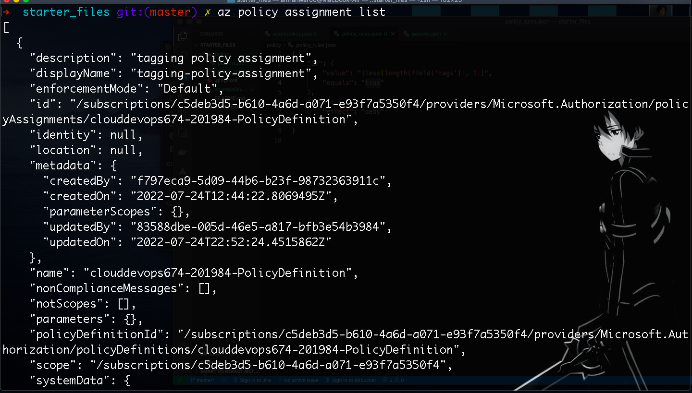
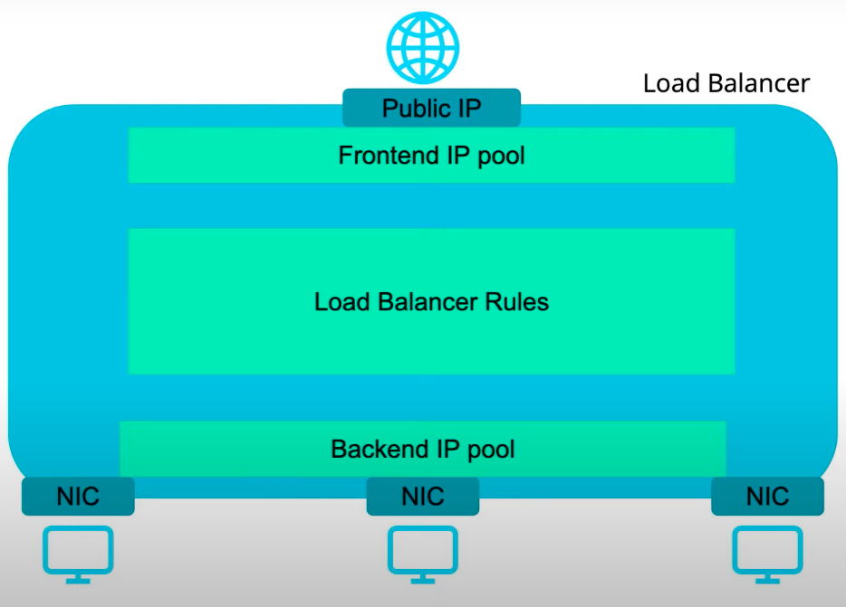
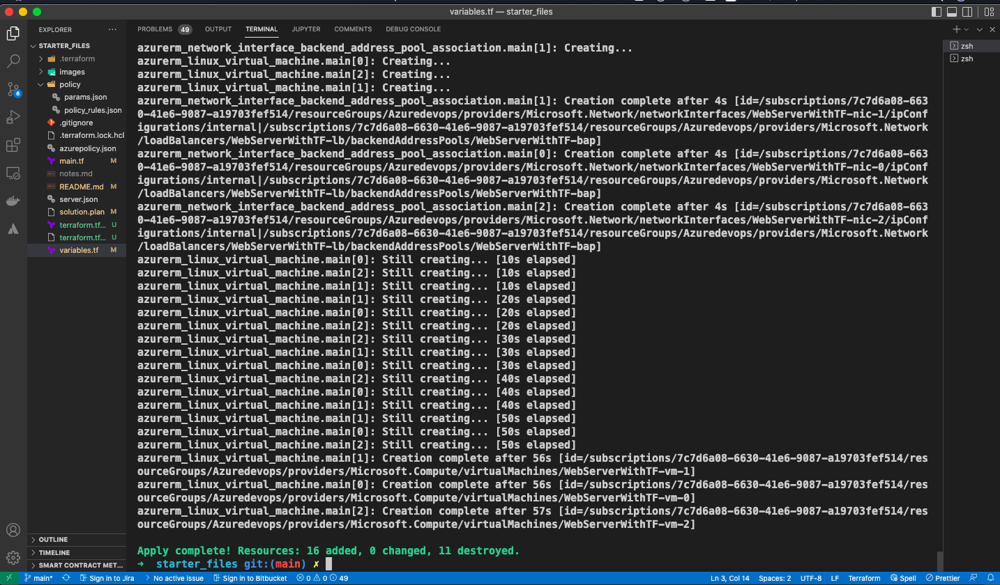

# Azure Infrastructure Operations Project: Deploying a scalable IaaS web server in Azure

### Introduction

a Packer template and a Terraform template to deploy a customizable, scalable web server in Azure.

### Getting Started

This project creates is Infrastructure as Code(IaC) project. Using Packer and Terraform, different web server resources were deployed in Azure.

#### Policy

-   First of all a policy were created using `policy/policy_rules.json` and `policy/params.json`, this policy prevent creating resources without tags
-   Policy info after creating it:
    

#### Packer image

Using `server.json` VM image was created

#### Terraform code

in `main.tf` code that create the web server resources, when running the script, will ask for image id, the packer image id should be added

### Dependencies

1. Create an [Azure Account](https://portal.azure.com)
2. Install the [Azure command line interface](https://docs.microsoft.com/en-us/cli/azure/install-azure-cli?view=azure-cli-latest)
3. Install [Packer](https://www.packer.io/downloads)
4. Install [Terraform](https://www.terraform.io/downloads.html)

### Variables

In `vars.tf` there are group of variables that can be set during the creating of the deployment plan or before it by setting default value

1. `username` and `password`: login information to the VMs
2. `vm_count`: number of VMs to be deployed (default: 3)
3. `image_id`: the `id` of the created Packer image
4. `prefix`: prefix name for the created resources
5. `location`: location of the created resources (default: `US East`)

### Instructions

#### Policy

1. add policy definition

```
az policy definition create --name tagging-policy --rules policy/policy_rules.json
```

2. assign policy

```
az policy assignment create --policy tagging-policy
```

#### Create packer image

1. build `server.json`

```
packer build server.json
```

#### Create terraform deployment plan

1. create `solution.plan`

```
terraform plan -out solution.plan
```

### Output

#### Files

-   `solution.plan`: this file can be used to deploy the resources.

#### Resources

As shown in the diagram the following resources will be deployed


-   Public id address to be accessible from the internet.
-   Load Balancer:
    -   Frontend IP Pool: 1-1 mapping with the public ip.
    -   Backend IP Pool: mapping to the VMs in their network.
-   VMs: Created VMs from the packer image.
-   Virtual network: Virtual network for the VMs, that contains subnets.
-   Security rules: to deny access to the internet and allow communication between the VMs.
#### Terraform Apply Output
Some resources were replaced(deleted) as I changed the name of the prefix in the second run.

```
➜  starter_files git:(main) ✗ terraform apply                  

azurerm_virtual_network.main: Refreshing state... [id=/subscriptions/7c7d6a08-6630-41e6-9087-a19703fef514/resourceGroups/Azuredevops/providers/Microsoft.Network/virtualNetworks/TestWebServerWithTF-network]
azurerm_availability_set.main: Refreshing state... [id=/subscriptions/7c7d6a08-6630-41e6-9087-a19703fef514/resourceGroups/Azuredevops/providers/Microsoft.Compute/availabilitySets/TestWebServerWithTF-aset]
azurerm_public_ip.main: Refreshing state... [id=/subscriptions/7c7d6a08-6630-41e6-9087-a19703fef514/resourceGroups/Azuredevops/providers/Microsoft.Network/publicIPAddresses/TestWebServerWithTF-pip]
azurerm_network_security_group.main: Refreshing state... [id=/subscriptions/7c7d6a08-6630-41e6-9087-a19703fef514/resourceGroups/Azuredevops/providers/Microsoft.Network/networkSecurityGroups/TestWebServerWithTF-nsg]
azurerm_subnet.internal: Refreshing state... [id=/subscriptions/7c7d6a08-6630-41e6-9087-a19703fef514/resourceGroups/Azuredevops/providers/Microsoft.Network/virtualNetworks/TestWebServerWithTF-network/subnets/internal]
azurerm_lb.main: Refreshing state... [id=/subscriptions/7c7d6a08-6630-41e6-9087-a19703fef514/resourceGroups/Azuredevops/providers/Microsoft.Network/loadBalancers/TestWebServerWithTF-lb]
azurerm_network_interface.main[2]: Refreshing state... [id=/subscriptions/7c7d6a08-6630-41e6-9087-a19703fef514/resourceGroups/Azuredevops/providers/Microsoft.Network/networkInterfaces/TestWebServerWithTF-nic-2]
azurerm_network_interface.main[1]: Refreshing state... [id=/subscriptions/7c7d6a08-6630-41e6-9087-a19703fef514/resourceGroups/Azuredevops/providers/Microsoft.Network/networkInterfaces/TestWebServerWithTF-nic-1]
azurerm_network_interface.main[0]: Refreshing state... [id=/subscriptions/7c7d6a08-6630-41e6-9087-a19703fef514/resourceGroups/Azuredevops/providers/Microsoft.Network/networkInterfaces/TestWebServerWithTF-nic]
azurerm_lb_backend_address_pool.main: Refreshing state... [id=/subscriptions/7c7d6a08-6630-41e6-9087-a19703fef514/resourceGroups/Azuredevops/providers/Microsoft.Network/loadBalancers/TestWebServerWithTF-lb/backendAddressPools/TestWebServerWithTF-bap]
azurerm_linux_virtual_machine.main[0]: Refreshing state... [id=/subscriptions/7c7d6a08-6630-41e6-9087-a19703fef514/resourceGroups/Azuredevops/providers/Microsoft.Compute/virtualMachines/TestWebServerWithTF-vm-0]

Terraform used the selected providers to generate the following execution plan. Resource actions are indicated with the
following symbols:
  + create
-/+ destroy and then create replacement

Terraform will perform the following actions:

  # azurerm_availability_set.main must be replaced
-/+ resource "azurerm_availability_set" "main" {
      ~ id                           = "/subscriptions/7c7d6a08-6630-41e6-9087-a19703fef514/resourceGroups/Azuredevops/providers/Microsoft.Compute/availabilitySets/TestWebServerWithTF-aset" -> (known after apply)
      ~ name                         = "TestWebServerWithTF-aset" -> "WebServerWithTF-aset" # forces replacement
        tags                         = {
            "environment" = "Production"
        }
        # (5 unchanged attributes hidden)
    }

  # azurerm_lb.main must be replaced
-/+ resource "azurerm_lb" "main" {
      ~ id                   = "/subscriptions/7c7d6a08-6630-41e6-9087-a19703fef514/resourceGroups/Azuredevops/providers/Microsoft.Network/loadBalancers/TestWebServerWithTF-lb" -> (known after apply)
      ~ name                 = "TestWebServerWithTF-lb" -> "WebServerWithTF-lb" # forces replacement
      + private_ip_address   = (known after apply)
      ~ private_ip_addresses = [] -> (known after apply)
        tags                 = {
            "environment" = "Production"
        }
        # (4 unchanged attributes hidden)

      ~ frontend_ip_configuration {
          + gateway_load_balancer_frontend_ip_configuration_id = (known after apply)
          ~ id                                                 = "/subscriptions/7c7d6a08-6630-41e6-9087-a19703fef514/resourceGroups/Azuredevops/providers/Microsoft.Network/loadBalancers/TestWebServerWithTF-lb/frontendIPConfigurations/TestWebServerWithTF-frontend-ip" -> (known after apply)
          ~ inbound_nat_rules                                  = [] -> (known after apply)
          ~ load_balancer_rules                                = [] -> (known after apply)
          ~ name                                               = "TestWebServerWithTF-frontend-ip" -> "WebServerWithTF-frontend-ip"
          ~ outbound_rules                                     = [] -> (known after apply)
          + private_ip_address                                 = (known after apply)
          ~ private_ip_address_allocation                      = "Dynamic" -> (known after apply)
          + private_ip_address_version                         = (known after apply)
          ~ public_ip_address_id                               = "/subscriptions/7c7d6a08-6630-41e6-9087-a19703fef514/resourceGroups/Azuredevops/providers/Microsoft.Network/publicIPAddresses/TestWebServerWithTF-pip" -> (known after apply)
          + public_ip_prefix_id                                = (known after apply)
          + subnet_id                                          = (known after apply)
          - zones                                              = [] -> null
        }
    }

  # azurerm_lb_backend_address_pool.main must be replaced
-/+ resource "azurerm_lb_backend_address_pool" "main" {
      ~ backend_ip_configurations = [] -> (known after apply)
      ~ id                        = "/subscriptions/7c7d6a08-6630-41e6-9087-a19703fef514/resourceGroups/Azuredevops/providers/Microsoft.Network/loadBalancers/TestWebServerWithTF-lb/backendAddressPools/TestWebServerWithTF-bap" -> (known after apply)
      ~ inbound_nat_rules         = [] -> (known after apply)
      ~ load_balancing_rules      = [] -> (known after apply)
      ~ loadbalancer_id           = "/subscriptions/7c7d6a08-6630-41e6-9087-a19703fef514/resourceGroups/Azuredevops/providers/Microsoft.Network/loadBalancers/TestWebServerWithTF-lb" -> (known after apply) # forces replacement
      ~ name                      = "TestWebServerWithTF-bap" -> "WebServerWithTF-bap" # forces replacement
      ~ outbound_rules            = [] -> (known after apply)
    }

  # azurerm_linux_virtual_machine.main[0] must be replaced
-/+ resource "azurerm_linux_virtual_machine" "main" {
      ~ availability_set_id             = "/subscriptions/7c7d6a08-6630-41e6-9087-a19703fef514/resourceGroups/Azuredevops/providers/Microsoft.Compute/availabilitySets/TESTWEBSERVERWITHTF-ASET" -> (known after apply) # forces replacement
      ~ computer_name                   = "TestWebServerWithTF-vm-0" -> (known after apply)
      - encryption_at_host_enabled      = false -> null
      ~ id                              = "/subscriptions/7c7d6a08-6630-41e6-9087-a19703fef514/resourceGroups/Azuredevops/providers/Microsoft.Compute/virtualMachines/TestWebServerWithTF-vm-0" -> (known after apply)
      ~ name                            = "TestWebServerWithTF-vm-0" -> "WebServerWithTF-vm-0" # forces replacement
      ~ network_interface_ids           = [
          - "/subscriptions/7c7d6a08-6630-41e6-9087-a19703fef514/resourceGroups/Azuredevops/providers/Microsoft.Network/networkInterfaces/TestWebServerWithTF-nic",
        ] -> (known after apply)
      ~ private_ip_address              = "10.0.2.4" -> (known after apply)
      ~ private_ip_addresses            = [
          - "10.0.2.4",
        ] -> (known after apply)
      + public_ip_address               = (known after apply)
      ~ public_ip_addresses             = [] -> (known after apply)
      - secure_boot_enabled             = false -> null
        tags                            = {
            "environment" = "Production"
        }
      ~ virtual_machine_id              = "649d4448-ff47-499c-9aea-569f4f895b31" -> (known after apply)
      - vtpm_enabled                    = false -> null
        # (14 unchanged attributes hidden)

      ~ os_disk {
          ~ disk_size_gb              = 30 -> (known after apply)
          ~ name                      = "TestWebServerWithTF-vm-0_disk1_088d99e096ff47118df5e07d3f08c23b" -> (known after apply)
            # (3 unchanged attributes hidden)
        }

      + termination_notification {
          + enabled = (known after apply)
          + timeout = (known after apply)
        }
    }

  # azurerm_linux_virtual_machine.main[1] will be created
  + resource "azurerm_linux_virtual_machine" "main" {
      + admin_password                  = (sensitive value)
      + admin_username                  = "amro"
      + allow_extension_operations      = true
      + availability_set_id             = (known after apply)
      + computer_name                   = (known after apply)
      + disable_password_authentication = false
      + extensions_time_budget          = "PT1H30M"
      + id                              = (known after apply)
      + location                        = "eastus"
      + max_bid_price                   = -1
      + name                            = "WebServerWithTF-vm-1"
      + network_interface_ids           = (known after apply)
      + patch_mode                      = "ImageDefault"
      + platform_fault_domain           = -1
      + priority                        = "Regular"
      + private_ip_address              = (known after apply)
      + private_ip_addresses            = (known after apply)
      + provision_vm_agent              = true
      + public_ip_address               = (known after apply)
      + public_ip_addresses             = (known after apply)
      + resource_group_name             = "Azuredevops"
      + size                            = "Standard_D2s_v3"
      + source_image_id                 = "/subscriptions/7c7d6a08-6630-41e6-9087-a19703fef514/resourceGroups/Azuredevops/providers/Microsoft.Compute/images/UbuntuPackerImage"
      + tags                            = {
          + "environment" = "Production"
        }
      + virtual_machine_id              = (known after apply)

      + os_disk {
          + caching                   = "ReadWrite"
          + disk_size_gb              = (known after apply)
          + name                      = (known after apply)
          + storage_account_type      = "Standard_LRS"
          + write_accelerator_enabled = false
        }

      + termination_notification {
          + enabled = (known after apply)
          + timeout = (known after apply)
        }
    }

  # azurerm_linux_virtual_machine.main[2] will be created
  + resource "azurerm_linux_virtual_machine" "main" {
      + admin_password                  = (sensitive value)
      + admin_username                  = "amro"
      + allow_extension_operations      = true
      + availability_set_id             = (known after apply)
      + computer_name                   = (known after apply)
      + disable_password_authentication = false
      + extensions_time_budget          = "PT1H30M"
      + id                              = (known after apply)
      + location                        = "eastus"
      + max_bid_price                   = -1
      + name                            = "WebServerWithTF-vm-2"
      + network_interface_ids           = (known after apply)
      + patch_mode                      = "ImageDefault"
      + platform_fault_domain           = -1
      + priority                        = "Regular"
      + private_ip_address              = (known after apply)
      + private_ip_addresses            = (known after apply)
      + provision_vm_agent              = true
      + public_ip_address               = (known after apply)
      + public_ip_addresses             = (known after apply)
      + resource_group_name             = "Azuredevops"
      + size                            = "Standard_D2s_v3"
      + source_image_id                 = "/subscriptions/7c7d6a08-6630-41e6-9087-a19703fef514/resourceGroups/Azuredevops/providers/Microsoft.Compute/images/UbuntuPackerImage"
      + tags                            = {
          + "environment" = "Production"
        }
      + virtual_machine_id              = (known after apply)

      + os_disk {
          + caching                   = "ReadWrite"
          + disk_size_gb              = (known after apply)
          + name                      = (known after apply)
          + storage_account_type      = "Standard_LRS"
          + write_accelerator_enabled = false
        }

      + termination_notification {
          + enabled = (known after apply)
          + timeout = (known after apply)
        }
    }

  # azurerm_network_interface.main[0] must be replaced
-/+ resource "azurerm_network_interface" "main" {
      ~ applied_dns_servers           = [] -> (known after apply)
      ~ dns_servers                   = [] -> (known after apply)
      ~ id                            = "/subscriptions/7c7d6a08-6630-41e6-9087-a19703fef514/resourceGroups/Azuredevops/providers/Microsoft.Network/networkInterfaces/TestWebServerWithTF-nic" -> (known after apply)
      + internal_dns_name_label       = (known after apply)
      ~ internal_domain_name_suffix   = "gmaqdjtywswuvinfhqatsb0v0h.bx.internal.cloudapp.net" -> (known after apply)
      ~ mac_address                   = "00-22-48-1D-12-39" -> (known after apply)
      ~ name                          = "TestWebServerWithTF-nic" -> "WebServerWithTF-nic-0" # forces replacement
      ~ private_ip_address            = "10.0.2.4" -> (known after apply)
      ~ private_ip_addresses          = [
          - "10.0.2.4",
        ] -> (known after apply)
        tags                          = {
            "environment" = "Production"
        }
      ~ virtual_machine_id            = "/subscriptions/7c7d6a08-6630-41e6-9087-a19703fef514/resourceGroups/Azuredevops/providers/Microsoft.Compute/virtualMachines/TestWebServerWithTF-vm-0" -> (known after apply)
        # (4 unchanged attributes hidden)

      ~ ip_configuration {
          + gateway_load_balancer_frontend_ip_configuration_id = (known after apply)
            name                                               = "internal"
          ~ primary                                            = true -> (known after apply)
          ~ private_ip_address                                 = "10.0.2.4" -> (known after apply)
          ~ subnet_id                                          = "/subscriptions/7c7d6a08-6630-41e6-9087-a19703fef514/resourceGroups/Azuredevops/providers/Microsoft.Network/virtualNetworks/TestWebServerWithTF-network/subnets/internal" -> (known after apply)
            # (2 unchanged attributes hidden)
        }
    }

  # azurerm_network_interface.main[1] must be replaced
-/+ resource "azurerm_network_interface" "main" {
      ~ applied_dns_servers           = [] -> (known after apply)
      ~ dns_servers                   = [] -> (known after apply)
      ~ id                            = "/subscriptions/7c7d6a08-6630-41e6-9087-a19703fef514/resourceGroups/Azuredevops/providers/Microsoft.Network/networkInterfaces/TestWebServerWithTF-nic-1" -> (known after apply)
      + internal_dns_name_label       = (known after apply)
      ~ internal_domain_name_suffix   = "gmaqdjtywswuvinfhqatsb0v0h.bx.internal.cloudapp.net" -> (known after apply)
      + mac_address                   = (known after apply)
      ~ name                          = "TestWebServerWithTF-nic-1" -> "WebServerWithTF-nic-1" # forces replacement
      ~ private_ip_address            = "10.0.2.6" -> (known after apply)
      ~ private_ip_addresses          = [
          - "10.0.2.6",
        ] -> (known after apply)
        tags                          = {
            "environment" = "Production"
        }
      + virtual_machine_id            = (known after apply)
        # (4 unchanged attributes hidden)

      ~ ip_configuration {
          + gateway_load_balancer_frontend_ip_configuration_id = (known after apply)
            name                                               = "internal"
          ~ primary                                            = true -> (known after apply)
          ~ private_ip_address                                 = "10.0.2.6" -> (known after apply)
          ~ subnet_id                                          = "/subscriptions/7c7d6a08-6630-41e6-9087-a19703fef514/resourceGroups/Azuredevops/providers/Microsoft.Network/virtualNetworks/TestWebServerWithTF-network/subnets/internal" -> (known after apply)
            # (2 unchanged attributes hidden)
        }
    }

  # azurerm_network_interface.main[2] must be replaced
-/+ resource "azurerm_network_interface" "main" {
      ~ applied_dns_servers           = [] -> (known after apply)
      ~ dns_servers                   = [] -> (known after apply)
      ~ id                            = "/subscriptions/7c7d6a08-6630-41e6-9087-a19703fef514/resourceGroups/Azuredevops/providers/Microsoft.Network/networkInterfaces/TestWebServerWithTF-nic-2" -> (known after apply)
      + internal_dns_name_label       = (known after apply)
      ~ internal_domain_name_suffix   = "gmaqdjtywswuvinfhqatsb0v0h.bx.internal.cloudapp.net" -> (known after apply)
      + mac_address                   = (known after apply)
      ~ name                          = "TestWebServerWithTF-nic-2" -> "WebServerWithTF-nic-2" # forces replacement
      ~ private_ip_address            = "10.0.2.5" -> (known after apply)
      ~ private_ip_addresses          = [
          - "10.0.2.5",
        ] -> (known after apply)
        tags                          = {
            "environment" = "Production"
        }
      + virtual_machine_id            = (known after apply)
        # (4 unchanged attributes hidden)

      ~ ip_configuration {
          + gateway_load_balancer_frontend_ip_configuration_id = (known after apply)
            name                                               = "internal"
          ~ primary                                            = true -> (known after apply)
          ~ private_ip_address                                 = "10.0.2.5" -> (known after apply)
          ~ subnet_id                                          = "/subscriptions/7c7d6a08-6630-41e6-9087-a19703fef514/resourceGroups/Azuredevops/providers/Microsoft.Network/virtualNetworks/TestWebServerWithTF-network/subnets/internal" -> (known after apply)
            # (2 unchanged attributes hidden)
        }
    }

  # azurerm_network_interface_backend_address_pool_association.main[0] will be created
  + resource "azurerm_network_interface_backend_address_pool_association" "main" {
      + backend_address_pool_id = (known after apply)
      + id                      = (known after apply)
      + ip_configuration_name   = "internal"
      + network_interface_id    = (known after apply)
    }

  # azurerm_network_interface_backend_address_pool_association.main[1] will be created
  + resource "azurerm_network_interface_backend_address_pool_association" "main" {
      + backend_address_pool_id = (known after apply)
      + id                      = (known after apply)
      + ip_configuration_name   = "internal"
      + network_interface_id    = (known after apply)
    }

  # azurerm_network_interface_backend_address_pool_association.main[2] will be created
  + resource "azurerm_network_interface_backend_address_pool_association" "main" {
      + backend_address_pool_id = (known after apply)
      + id                      = (known after apply)
      + ip_configuration_name   = "internal"
      + network_interface_id    = (known after apply)
    }

  # azurerm_network_security_group.main must be replaced
-/+ resource "azurerm_network_security_group" "main" {
      ~ id                  = "/subscriptions/7c7d6a08-6630-41e6-9087-a19703fef514/resourceGroups/Azuredevops/providers/Microsoft.Network/networkSecurityGroups/TestWebServerWithTF-nsg" -> (known after apply)
      ~ name                = "TestWebServerWithTF-nsg" -> "WebServerWithTF-nsg" # forces replacement
      ~ security_rule       = [
          - {
              - access                                     = "Allow"
              - description                                = ""
              - destination_address_prefix                 = "VirtualNetwork"
              - destination_address_prefixes               = []
              - destination_application_security_group_ids = []
              - destination_port_range                     = "*"
              - destination_port_ranges                    = []
              - direction                                  = "Inbound"
              - name                                       = "TestWebServerWithTF-nsg-vm-rule"
              - priority                                   = 100
              - protocol                                   = "Tcp"
              - source_address_prefix                      = "VirtualNetwork"
              - source_address_prefixes                    = []
              - source_application_security_group_ids      = []
              - source_port_range                          = "*"
              - source_port_ranges                         = []
            },
          + {
              + access                                     = "Allow"
              + description                                = ""
              + destination_address_prefix                 = "VirtualNetwork"
              + destination_address_prefixes               = []
              + destination_application_security_group_ids = []
              + destination_port_range                     = "*"
              + destination_port_ranges                    = []
              + direction                                  = "Inbound"
              + name                                       = "WebServerWithTF-nsg-vm-rule"
              + priority                                   = 100
              + protocol                                   = "Tcp"
              + source_address_prefix                      = "VirtualNetwork"
              + source_address_prefixes                    = []
              + source_application_security_group_ids      = []
              + source_port_range                          = "*"
              + source_port_ranges                         = []
            },
          - {
              - access                                     = "Deny"
              - description                                = ""
              - destination_address_prefix                 = "*"
              - destination_address_prefixes               = []
              - destination_application_security_group_ids = []
              - destination_port_range                     = "*"
              - destination_port_ranges                    = []
              - direction                                  = "Inbound"
              - name                                       = "TestWebServerWithTF-nsg-internet-rule"
              - priority                                   = 200
              - protocol                                   = "Tcp"
              - source_address_prefix                      = "Internet"
              - source_address_prefixes                    = []
              - source_application_security_group_ids      = []
              - source_port_range                          = "*"
              - source_port_ranges                         = []
            },
          + {
              + access                                     = "Deny"
              + description                                = ""
              + destination_address_prefix                 = "*"
              + destination_address_prefixes               = []
              + destination_application_security_group_ids = []
              + destination_port_range                     = "*"
              + destination_port_ranges                    = []
              + direction                                  = "Inbound"
              + name                                       = "WebServerWithTF-nsg-internet-rule"
              + priority                                   = 200
              + protocol                                   = "Tcp"
              + source_address_prefix                      = "Internet"
              + source_address_prefixes                    = []
              + source_application_security_group_ids      = []
              + source_port_range                          = "*"
              + source_port_ranges                         = []
            },
        ]
        tags                = {
            "environment" = "Production"
        }
        # (2 unchanged attributes hidden)
    }

  # azurerm_public_ip.main must be replaced
-/+ resource "azurerm_public_ip" "main" {
      + fqdn                    = (known after apply)
      ~ id                      = "/subscriptions/7c7d6a08-6630-41e6-9087-a19703fef514/resourceGroups/Azuredevops/providers/Microsoft.Network/publicIPAddresses/TestWebServerWithTF-pip" -> (known after apply)
      ~ ip_address              = "40.114.80.12" -> (known after apply)
      - ip_tags                 = {} -> null
      ~ name                    = "TestWebServerWithTF-pip" -> "WebServerWithTF-pip" # forces replacement
        tags                    = {
            "environment" = "Production"
        }
      - zones                   = [] -> null
        # (7 unchanged attributes hidden)
    }

  # azurerm_subnet.internal must be replaced
-/+ resource "azurerm_subnet" "internal" {
      ~ id                                             = "/subscriptions/7c7d6a08-6630-41e6-9087-a19703fef514/resourceGroups/Azuredevops/providers/Microsoft.Network/virtualNetworks/TestWebServerWithTF-network/subnets/internal" -> (known after apply)
        name                                           = "internal"
      - service_endpoint_policy_ids                    = [] -> null
      - service_endpoints                              = [] -> null
      ~ virtual_network_name                           = "TestWebServerWithTF-network" -> "WebServerWithTF-network" # forces replacement
        # (4 unchanged attributes hidden)
    }

  # azurerm_virtual_network.main must be replaced
-/+ resource "azurerm_virtual_network" "main" {
      ~ dns_servers             = [] -> (known after apply)
      - flow_timeout_in_minutes = 0 -> null
      ~ guid                    = "a6010133-b478-4aad-a1a5-3c01390755d7" -> (known after apply)
      ~ id                      = "/subscriptions/7c7d6a08-6630-41e6-9087-a19703fef514/resourceGroups/Azuredevops/providers/Microsoft.Network/virtualNetworks/TestWebServerWithTF-network" -> (known after apply)
      ~ name                    = "TestWebServerWithTF-network" -> "WebServerWithTF-network" # forces replacement
      ~ subnet                  = [
          - {
              - address_prefix = "10.0.2.0/24"
              - id             = "/subscriptions/7c7d6a08-6630-41e6-9087-a19703fef514/resourceGroups/Azuredevops/providers/Microsoft.Network/virtualNetworks/TestWebServerWithTF-network/subnets/internal"
              - name           = "internal"
              - security_group = ""
            },
        ] -> (known after apply)
        tags                    = {
            "environment" = "Production"
        }
        # (3 unchanged attributes hidden)
    }

Plan: 16 to add, 0 to change, 11 to destroy.

Do you want to perform these actions?
  Terraform will perform the actions described above.
  Only 'yes' will be accepted to approve.

  Enter a value: yes

azurerm_lb_backend_address_pool.main: Destroying... [id=/subscriptions/7c7d6a08-6630-41e6-9087-a19703fef514/resourceGroups/Azuredevops/providers/Microsoft.Network/loadBalancers/TestWebServerWithTF-lb/backendAddressPools/TestWebServerWithTF-bap]
azurerm_network_security_group.main: Destroying... [id=/subscriptions/7c7d6a08-6630-41e6-9087-a19703fef514/resourceGroups/Azuredevops/providers/Microsoft.Network/networkSecurityGroups/TestWebServerWithTF-nsg]
azurerm_linux_virtual_machine.main[0]: Destroying... [id=/subscriptions/7c7d6a08-6630-41e6-9087-a19703fef514/resourceGroups/Azuredevops/providers/Microsoft.Compute/virtualMachines/TestWebServerWithTF-vm-0]
azurerm_lb_backend_address_pool.main: Destruction complete after 5s
azurerm_lb.main: Destroying... [id=/subscriptions/7c7d6a08-6630-41e6-9087-a19703fef514/resourceGroups/Azuredevops/providers/Microsoft.Network/loadBalancers/TestWebServerWithTF-lb]
azurerm_network_security_group.main: Still destroying... [id=/subscriptions/7c7d6a08-6630-41e6-9087-...SecurityGroups/TestWebServerWithTF-nsg, 10s elapsed]
azurerm_linux_virtual_machine.main[0]: Still destroying... [id=/subscriptions/7c7d6a08-6630-41e6-9087-...rtualMachines/TestWebServerWithTF-vm-0, 10s elapsed]
azurerm_network_security_group.main: Destruction complete after 11s
azurerm_network_security_group.main: Creating...
azurerm_lb.main: Still destroying... [id=/subscriptions/7c7d6a08-6630-41e6-9087-...k/loadBalancers/TestWebServerWithTF-lb, 10s elapsed]
azurerm_lb.main: Destruction complete after 11s
azurerm_public_ip.main: Destroying... [id=/subscriptions/7c7d6a08-6630-41e6-9087-a19703fef514/resourceGroups/Azuredevops/providers/Microsoft.Network/publicIPAddresses/TestWebServerWithTF-pip]
azurerm_linux_virtual_machine.main[0]: Still destroying... [id=/subscriptions/7c7d6a08-6630-41e6-9087-...rtualMachines/TestWebServerWithTF-vm-0, 20s elapsed]
azurerm_network_security_group.main: Still creating... [10s elapsed]
azurerm_network_security_group.main: Creation complete after 11s [id=/subscriptions/7c7d6a08-6630-41e6-9087-a19703fef514/resourceGroups/Azuredevops/providers/Microsoft.Network/networkSecurityGroups/WebServerWithTF-nsg]
azurerm_public_ip.main: Still destroying... [id=/subscriptions/7c7d6a08-6630-41e6-9087-...licIPAddresses/TestWebServerWithTF-pip, 10s elapsed]
azurerm_public_ip.main: Destruction complete after 12s
azurerm_public_ip.main: Creating...
azurerm_linux_virtual_machine.main[0]: Still destroying... [id=/subscriptions/7c7d6a08-6630-41e6-9087-...rtualMachines/TestWebServerWithTF-vm-0, 30s elapsed]
azurerm_public_ip.main: Creation complete after 7s [id=/subscriptions/7c7d6a08-6630-41e6-9087-a19703fef514/resourceGroups/Azuredevops/providers/Microsoft.Network/publicIPAddresses/WebServerWithTF-pip]
azurerm_lb.main: Creating...
azurerm_linux_virtual_machine.main[0]: Still destroying... [id=/subscriptions/7c7d6a08-6630-41e6-9087-...rtualMachines/TestWebServerWithTF-vm-0, 40s elapsed]
azurerm_lb.main: Creation complete after 6s [id=/subscriptions/7c7d6a08-6630-41e6-9087-a19703fef514/resourceGroups/Azuredevops/providers/Microsoft.Network/loadBalancers/WebServerWithTF-lb]
azurerm_lb_backend_address_pool.main: Creating...
azurerm_lb_backend_address_pool.main: Creation complete after 4s [id=/subscriptions/7c7d6a08-6630-41e6-9087-a19703fef514/resourceGroups/Azuredevops/providers/Microsoft.Network/loadBalancers/WebServerWithTF-lb/backendAddressPools/WebServerWithTF-bap]
azurerm_linux_virtual_machine.main[0]: Still destroying... [id=/subscriptions/7c7d6a08-6630-41e6-9087-...rtualMachines/TestWebServerWithTF-vm-0, 50s elapsed]
azurerm_linux_virtual_machine.main[0]: Destruction complete after 51s
azurerm_availability_set.main: Destroying... [id=/subscriptions/7c7d6a08-6630-41e6-9087-a19703fef514/resourceGroups/Azuredevops/providers/Microsoft.Compute/availabilitySets/TestWebServerWithTF-aset]
azurerm_network_interface.main[0]: Destroying... [id=/subscriptions/7c7d6a08-6630-41e6-9087-a19703fef514/resourceGroups/Azuredevops/providers/Microsoft.Network/networkInterfaces/TestWebServerWithTF-nic]
azurerm_network_interface.main[1]: Destroying... [id=/subscriptions/7c7d6a08-6630-41e6-9087-a19703fef514/resourceGroups/Azuredevops/providers/Microsoft.Network/networkInterfaces/TestWebServerWithTF-nic-1]
azurerm_network_interface.main[2]: Destroying... [id=/subscriptions/7c7d6a08-6630-41e6-9087-a19703fef514/resourceGroups/Azuredevops/providers/Microsoft.Network/networkInterfaces/TestWebServerWithTF-nic-2]
azurerm_availability_set.main: Destruction complete after 6s
azurerm_availability_set.main: Creating...
azurerm_network_interface.main[2]: Still destroying... [id=/subscriptions/7c7d6a08-6630-41e6-9087-...rkInterfaces/TestWebServerWithTF-nic-2, 10s elapsed]
azurerm_network_interface.main[0]: Still destroying... [id=/subscriptions/7c7d6a08-6630-41e6-9087-...workInterfaces/TestWebServerWithTF-nic, 10s elapsed]
azurerm_network_interface.main[1]: Still destroying... [id=/subscriptions/7c7d6a08-6630-41e6-9087-...rkInterfaces/TestWebServerWithTF-nic-1, 10s elapsed]
azurerm_availability_set.main: Creation complete after 5s [id=/subscriptions/7c7d6a08-6630-41e6-9087-a19703fef514/resourceGroups/Azuredevops/providers/Microsoft.Compute/availabilitySets/WebServerWithTF-aset]
azurerm_network_interface.main[1]: Destruction complete after 12s
azurerm_network_interface.main[2]: Destruction complete after 19s
azurerm_network_interface.main[0]: Still destroying... [id=/subscriptions/7c7d6a08-6630-41e6-9087-...workInterfaces/TestWebServerWithTF-nic, 20s elapsed]
azurerm_network_interface.main[0]: Destruction complete after 24s
azurerm_subnet.internal: Destroying... [id=/subscriptions/7c7d6a08-6630-41e6-9087-a19703fef514/resourceGroups/Azuredevops/providers/Microsoft.Network/virtualNetworks/TestWebServerWithTF-network/subnets/internal]
azurerm_subnet.internal: Still destroying... [id=/subscriptions/7c7d6a08-6630-41e6-9087-...bServerWithTF-network/subnets/internal, 10s elapsed]
azurerm_subnet.internal: Destruction complete after 11s
azurerm_virtual_network.main: Destroying... [id=/subscriptions/7c7d6a08-6630-41e6-9087-a19703fef514/resourceGroups/Azuredevops/providers/Microsoft.Network/virtualNetworks/TestWebServerWithTF-network]
azurerm_virtual_network.main: Still destroying... [id=/subscriptions/7c7d6a08-6630-41e6-9087-...alNetworks/TestWebServerWithTF-network, 10s elapsed]
azurerm_virtual_network.main: Destruction complete after 11s
azurerm_virtual_network.main: Creating...
azurerm_virtual_network.main: Still creating... [10s elapsed]
azurerm_virtual_network.main: Creation complete after 14s [id=/subscriptions/7c7d6a08-6630-41e6-9087-a19703fef514/resourceGroups/Azuredevops/providers/Microsoft.Network/virtualNetworks/WebServerWithTF-network]
azurerm_subnet.internal: Creating...
azurerm_subnet.internal: Creation complete after 6s [id=/subscriptions/7c7d6a08-6630-41e6-9087-a19703fef514/resourceGroups/Azuredevops/providers/Microsoft.Network/virtualNetworks/WebServerWithTF-network/subnets/internal]
azurerm_network_interface.main[0]: Creating...
azurerm_network_interface.main[2]: Creating...
azurerm_network_interface.main[1]: Creating...
azurerm_network_interface.main[2]: Creation complete after 6s [id=/subscriptions/7c7d6a08-6630-41e6-9087-a19703fef514/resourceGroups/Azuredevops/providers/Microsoft.Network/networkInterfaces/WebServerWithTF-nic-2]
azurerm_network_interface.main[1]: Still creating... [10s elapsed]
azurerm_network_interface.main[0]: Still creating... [10s elapsed]
azurerm_network_interface.main[1]: Creation complete after 10s [id=/subscriptions/7c7d6a08-6630-41e6-9087-a19703fef514/resourceGroups/Azuredevops/providers/Microsoft.Network/networkInterfaces/WebServerWithTF-nic-1]
azurerm_network_interface.main[0]: Creation complete after 15s [id=/subscriptions/7c7d6a08-6630-41e6-9087-a19703fef514/resourceGroups/Azuredevops/providers/Microsoft.Network/networkInterfaces/WebServerWithTF-nic-0]
azurerm_network_interface_backend_address_pool_association.main[2]: Creating...
azurerm_network_interface_backend_address_pool_association.main[0]: Creating...
azurerm_network_interface_backend_address_pool_association.main[1]: Creating...
azurerm_linux_virtual_machine.main[0]: Creating...
azurerm_linux_virtual_machine.main[2]: Creating...
azurerm_linux_virtual_machine.main[1]: Creating...
azurerm_network_interface_backend_address_pool_association.main[1]: Creation complete after 4s [id=/subscriptions/7c7d6a08-6630-41e6-9087-a19703fef514/resourceGroups/Azuredevops/providers/Microsoft.Network/networkInterfaces/WebServerWithTF-nic-1/ipConfigurations/internal|/subscriptions/7c7d6a08-6630-41e6-9087-a19703fef514/resourceGroups/Azuredevops/providers/Microsoft.Network/loadBalancers/WebServerWithTF-lb/backendAddressPools/WebServerWithTF-bap]
azurerm_network_interface_backend_address_pool_association.main[0]: Creation complete after 4s [id=/subscriptions/7c7d6a08-6630-41e6-9087-a19703fef514/resourceGroups/Azuredevops/providers/Microsoft.Network/networkInterfaces/WebServerWithTF-nic-0/ipConfigurations/internal|/subscriptions/7c7d6a08-6630-41e6-9087-a19703fef514/resourceGroups/Azuredevops/providers/Microsoft.Network/loadBalancers/WebServerWithTF-lb/backendAddressPools/WebServerWithTF-bap]
azurerm_network_interface_backend_address_pool_association.main[2]: Creation complete after 4s [id=/subscriptions/7c7d6a08-6630-41e6-9087-a19703fef514/resourceGroups/Azuredevops/providers/Microsoft.Network/networkInterfaces/WebServerWithTF-nic-2/ipConfigurations/internal|/subscriptions/7c7d6a08-6630-41e6-9087-a19703fef514/resourceGroups/Azuredevops/providers/Microsoft.Network/loadBalancers/WebServerWithTF-lb/backendAddressPools/WebServerWithTF-bap]
azurerm_linux_virtual_machine.main[0]: Still creating... [10s elapsed]
azurerm_linux_virtual_machine.main[2]: Still creating... [10s elapsed]
azurerm_linux_virtual_machine.main[1]: Still creating... [10s elapsed]
azurerm_linux_virtual_machine.main[1]: Still creating... [20s elapsed]
azurerm_linux_virtual_machine.main[0]: Still creating... [20s elapsed]
azurerm_linux_virtual_machine.main[2]: Still creating... [20s elapsed]
azurerm_linux_virtual_machine.main[2]: Still creating... [30s elapsed]
azurerm_linux_virtual_machine.main[1]: Still creating... [30s elapsed]
azurerm_linux_virtual_machine.main[0]: Still creating... [30s elapsed]
azurerm_linux_virtual_machine.main[2]: Still creating... [40s elapsed]
azurerm_linux_virtual_machine.main[0]: Still creating... [40s elapsed]
azurerm_linux_virtual_machine.main[1]: Still creating... [40s elapsed]
azurerm_linux_virtual_machine.main[1]: Still creating... [50s elapsed]
azurerm_linux_virtual_machine.main[0]: Still creating... [50s elapsed]
azurerm_linux_virtual_machine.main[2]: Still creating... [50s elapsed]
azurerm_linux_virtual_machine.main[1]: Creation complete after 56s [id=/subscriptions/7c7d6a08-6630-41e6-9087-a19703fef514/resourceGroups/Azuredevops/providers/Microsoft.Compute/virtualMachines/WebServerWithTF-vm-1]
azurerm_linux_virtual_machine.main[0]: Creation complete after 56s [id=/subscriptions/7c7d6a08-6630-41e6-9087-a19703fef514/resourceGroups/Azuredevops/providers/Microsoft.Compute/virtualMachines/WebServerWithTF-vm-0]
azurerm_linux_virtual_machine.main[2]: Creation complete after 57s [id=/subscriptions/7c7d6a08-6630-41e6-9087-a19703fef514/resourceGroups/Azuredevops/providers/Microsoft.Compute/virtualMachines/WebServerWithTF-vm-2]

Apply complete! Resources: 16 added, 0 changed, 11 destroyed.

```
#### Policy Console Output
```
➜  starter_files git:(main) ✗ az policy definition create --name tagging-policy --rules policy/policy_rules.json
{
  "description": null,
  "displayName": null,
  "id": "/subscriptions/7c7d6a08-6630-41e6-9087-a19703fef514/providers/Microsoft.Authorization/policyDefinitions/tagging-policy",
  "metadata": {
    "createdBy": "0847425c-aea8-4997-9f1a-801d09e105ce",
    "createdOn": "2022-07-27T14:45:04.7342118Z",
    "updatedBy": null,
    "updatedOn": null
  },
  "mode": "Indexed",
  "name": "tagging-policy",
  "parameters": null,
  "policyRule": {
    "if": {
      "equals": "true",
      "value": "[less(length(field('tags')), 1)]"
    },
    "then": {
      "effect": "deny"
    }
  },
  "policyType": "Custom",
  "systemData": {
    "createdAt": "2022-07-27T14:45:04.693544+00:00",
    "createdBy": "odl_user_202411@udacityhol.onmicrosoft.com",
    "createdByType": "User",
    "lastModifiedAt": "2022-07-27T14:45:04.693544+00:00",
    "lastModifiedBy": "odl_user_202411@udacityhol.onmicrosoft.com",
    "lastModifiedByType": "User"
  },
  "type": "Microsoft.Authorization/policyDefinitions"
}
➜  starter_files git:(main) ✗ az policy assignment create --policy tagging-policy

{
  "description": null,
  "displayName": null,
  "enforcementMode": "Default",
  "id": "/subscriptions/7c7d6a08-6630-41e6-9087-a19703fef514/providers/Microsoft.Authorization/policyAssignments/tYhwQFlRR2qM62MPmNBRpw",
  "identity": null,
  "location": null,
  "metadata": {
    "createdBy": "0847425c-aea8-4997-9f1a-801d09e105ce",
    "createdOn": "2022-07-27T14:45:11.5272432Z",
    "updatedBy": null,
    "updatedOn": null
  },
  "name": "tYhwQFlRR2qM62MPmNBRpw",
  "nonComplianceMessages": null,
  "notScopes": null,
  "parameters": null,
  "policyDefinitionId": "/subscriptions/7c7d6a08-6630-41e6-9087-a19703fef514/providers/Microsoft.Authorization/policyDefinitions/tagging-policy",
  "scope": "/subscriptions/7c7d6a08-6630-41e6-9087-a19703fef514",
  "systemData": {
    "createdAt": "2022-07-27T14:45:11.492256+00:00",
    "createdBy": "odl_user_202411@udacityhol.onmicrosoft.com",
    "createdByType": "User",
    "lastModifiedAt": "2022-07-27T14:45:11.492256+00:00",
    "lastModifiedBy": "odl_user_202411@udacityhol.onmicrosoft.com",
    "lastModifiedByType": "User"
  },
  "type": "Microsoft.Authorization/policyAssignments"
}
```